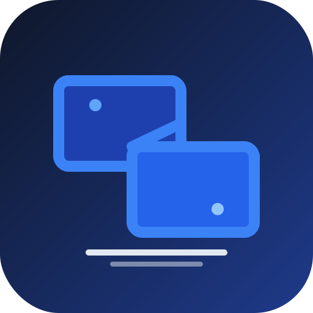

# LAN File Share

Aplikasi desktop (Electron) + PWA untuk berbagi file antara **PC** dan **HP** di jaringan lokal yang sama. Tampilan biasa layaknya aplikasi biasa, cuma tinggal masukin nama device terus saling akses file.



## Cara kerja singkat

```
┌──────────────┐        WiFi yang sama         ┌──────────────┐
│   PC / Mac   │  <───── LAN ─────>            │      HP      │
│  Electron    │      Express + WS              │  Browser /   │
│   App        │      port 5000                 │  PWA install │
└──────────────┘                                └──────────────┘
```

- Di **PC**: jalanin Electron app. App ini sekaligus jalanin server di `http://<ip-lan>:5000`.
- Di **HP**: buka alamat itu di Chrome/Safari → "Add to Home Screen" → jadi ikon aplikasi.
- Kedua device daftar nama masing-masing (contoh: `PC-Faiz`, `HP-Saya`) dan bisa saling browse folder, upload, download, preview foto, rename, hapus, bikin folder, search, dan bikin share link.

## Fitur

- Browse folder (breadcrumbs, grid view)
- Upload file (drag & drop dan tombol)
- Download file
- Preview foto, video, audio, dan teks langsung di app
- Rename & hapus file / folder
- Bikin folder baru (mkdir)
- Search di folder aktif (rekursif)
- Share link dengan expiry (15 menit — 7 hari)
- Device registry real-time via WebSocket (liat siapa yang lagi online)
- QR code di PC untuk disan dari HP
- PWA manifest + service worker → HP bisa install sebagai aplikasi

## Persyaratan

- Node.js 18+
- Semua device harus di **WiFi / LAN yang sama**
- Firewall PC harus izinin port `5000` (atau port yang kamu set) di jaringan private

## Jalankan di PC (Electron)

```bash
npm install
npm start
```

Saat pertama kali jalan, app bakal:
1. Bikin folder `~/LanFileShare` (atau folder yang kamu pilih) sebagai root shared.
2. Start server di port `5000`.
3. Buka window Electron.

Klik tombol **QR** di atas → scan dari HP.

### Mode server-only (tanpa Electron)

Kalau mau jalanin sebagai server biasa (misal di server headless / Raspberry Pi):

```bash
npm install
npm run server
# server jalan di 0.0.0.0:5000
```

Environment variables:
- `LAN_FILE_SHARE_PORT` — port (default `5000`)
- `LAN_FILE_SHARE_ROOT` — path folder yang dishare (default `~/LanFileShare`)

## Jalankan di HP (PWA)

1. Pastikan HP & PC di WiFi yang sama.
2. Buka Chrome / Safari → ketik alamat yang muncul di QR (misal `http://192.168.1.5:5000`).
3. Masukin nama HP (misal `HP-Faiz`).
4. Menu browser → **Add to Home Screen** / **Install app** → ikon app keluar di home screen.

## Struktur folder

```
.
├── main.js              # Electron main process
├── preload.js           # Preload (contextBridge)
├── server.js            # Express + WebSocket server
├── public/              # Frontend (PWA)
│   ├── index.html
│   ├── app.js
│   ├── styles.css
│   ├── manifest.webmanifest
│   ├── service-worker.js
│   └── icons/
├── scripts/
│   └── generate-icons.js
└── package.json
```

## Keamanan

- Semua device yang connect ke LAN bisa akses. **Jangan** jalanin app ini di WiFi publik — ini didesain untuk jaringan rumah / kantor.
- Share link punya token acak 32-hex-char + expiry; hanya valid selama belum expired.
- Path traversal diproteksi: semua akses dibatasi ke `sharedRoot`.
- Upload dibatasi 10 GB per file (bisa diubah di `server.js`).

## Roadmap

- [ ] Autentikasi per-device (PIN / passcode)
- [ ] HTTPS dengan self-signed cert (biar service worker dan Camera API jalan)
- [ ] mDNS / Bonjour discovery biar nggak perlu ketik IP
- [ ] Build installer Electron (dmg / exe / AppImage)
- [ ] Folder isolation per-device (private folder)

## Lisensi

MIT
